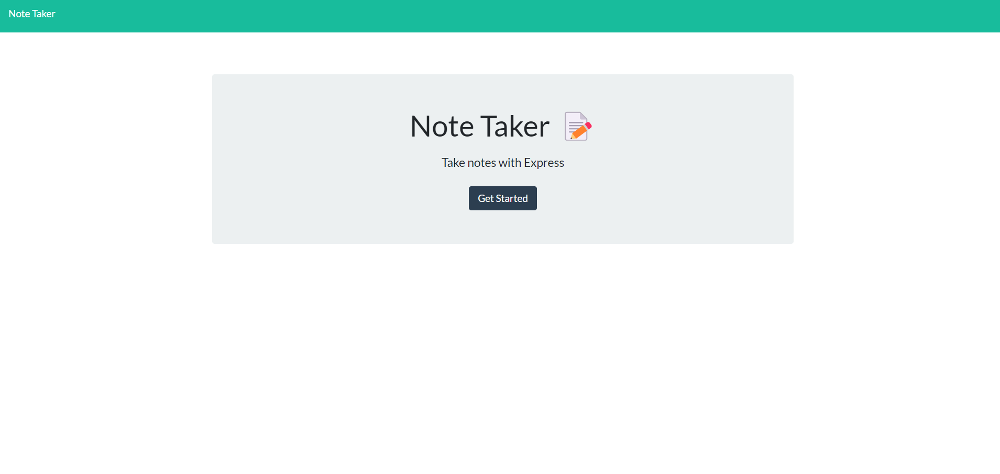
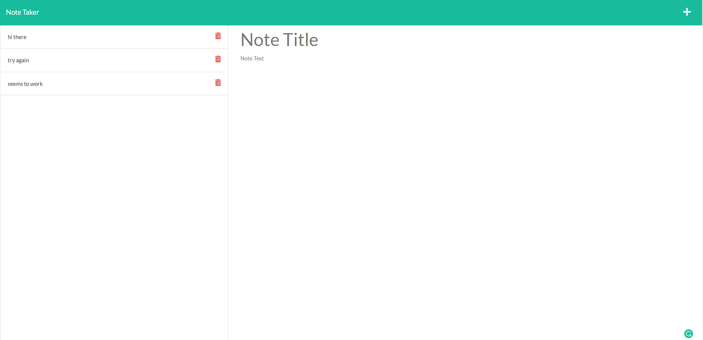

# note_taker

## Description

The motivation for this application was to create a site that could save and show any notes you need for later and can access from anywhere. I built this project to practice working with express and build an express server that connects the front and back end. It solves the problem of needing to save a note for later but not wanting to write it down and not always having access to it. I learned a lot about how to connect the front and back end and building out an express server.

## Table of Contents 

If your README is long, add a table of contents to make it easy for users to find what they need.

- [Installation](#installation)
- [Usage](#usage)
- [Credits](#credits)
- [License](#license)

## Installation

No installation is required. Access application at the URL with any web browser. 

## Usage

To use application go to the URL with any web browser and click the get started button to go to the notes page.

On the notes page you can see any existing notes on the left and a field for title and your note's text on the right. Type in a title for your note and then fill out the text field below. Click the save icon above to save the note. You can click on the past notes titles on the left and see your older notes. If you want to delete a note click on the delete button on the saved note.

## Credits

Used Express, UUID, Util, and Node.
Starter code from EdX

## License

None

---